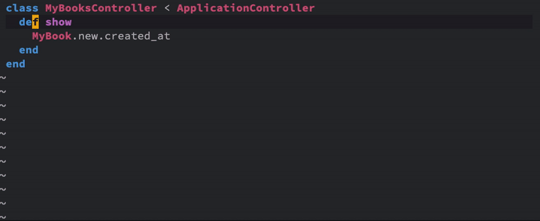

# SolargraphRails - Help solargraph with Rails

## Work in progress - here be dragons
There are significant rough edges to this gem still. Don't use it if you're not willing to do things like build gems from source and install them locally.

## Models
Given a typical Rails model like this:

```ruby
# == Schema Information
#
# Table name: my_books
#
#  id         :integer          not null, primary key
#  author     :string
#  name       :string
#  created_at :datetime         not null
#  updated_at :datetime         not null
#
class MyBook < ApplicationRecord
  def my_method
    "hello"
  end

  ...

end
```

The various Ruby intellisense tools are ok at knowing that there is a `MyBook` constant, and some (including Solargraph) are even aware that objects like `MyBook.new` have a method `.my_method`. But what about those magical dynamic attributes that ActiveRecord creates when Rails starts up? You can see these listed at the top of the file under `# == Schema Information`, the comments helpfully added by the Annotate gem.

Since these attributes are only created at runtime, static analysis alone can't identify them. Your editor has no idea that these attributes exist, but they're amongst the most common things that you will work with in any Rails app.

That's where this plugin for Solargraph comes in: it parses the schema comments left by Annotate and uses those to give Solargraph some extra hints.

With this you get autocompletion on ActiveRecord attributes:

 
 
... and go to definition commands take you to the schema comment for that column:


 

... and peek commands show you documentation about the attribute:

 

### Reload workspace after migrations
Solargraph won't know about attributes that you add during a session. Restart your LSP workspace to get the new attributes.

For my setup with Emacs, that means running `M-x lsp-restart-workspace`, YMMV in other editors.

## Associations
This is coming soon.

## Known issues
This project is WIP and is unlikely to work on your Rails project out of the box. Check out the issues tab and contribute if you are interested.

## Installation

###  Install `solargraph` v0.40+ and `solargraph_rails`
Typically gems like these are not installed via the Gemfile, because most projects have more than one contributor and other contributors might have different setups for their editors in mind. Instead you need to use `gem install`.

SG v0.40 and solargraph_rails are unreleased at time of writing. To install gems locally you will need to clone the source from github, run `gem build` in the directory where you cloned the source, then run `gem install --local /path/to/generated_file.gem` to get solargraph into the executable path and solargraph_rails into a place where `solargraph` can find it when it loads plugins.

### Add `solargraph_rails` to your `.solargraph.yml`

```
plugins:
  - solargraph_rails
```

### Add annotate
Add schema comments your model files using [Annotate](https://github.com/ctran/annotate_models/). At the moment SolargraphRails assumes your schema comments are at the top of the source file.

## Development

Fork the project, start hacking, put up a PR :).

When you make changes, you probably need to shut down solargraph and restart it (maybe that requires you to shut down your whole editor?). You can speed up the feedback loop by running

`api_map = Solargraph::ApiMap.load(Rails.root)`

in the console of the Rails project where solargraph_rails is installed. This may require restarting the rails console each time, and possibly killing Spring.

Once you have an instance of `Solargraph::ApiMap`, you can interrogate it with Solargraph code like:

`pins = api_map.get_methods('MyBook')`

More examples here: https://solargraph.org/guides/code-examples

## Contributing

Bug reports and pull requests are welcome on GitHub at https://github.com/iftheshoefritz/solargraph_rails.

## License

The gem is available as open source under the terms of the [MIT License](https://opensource.org/licenses/MIT).
